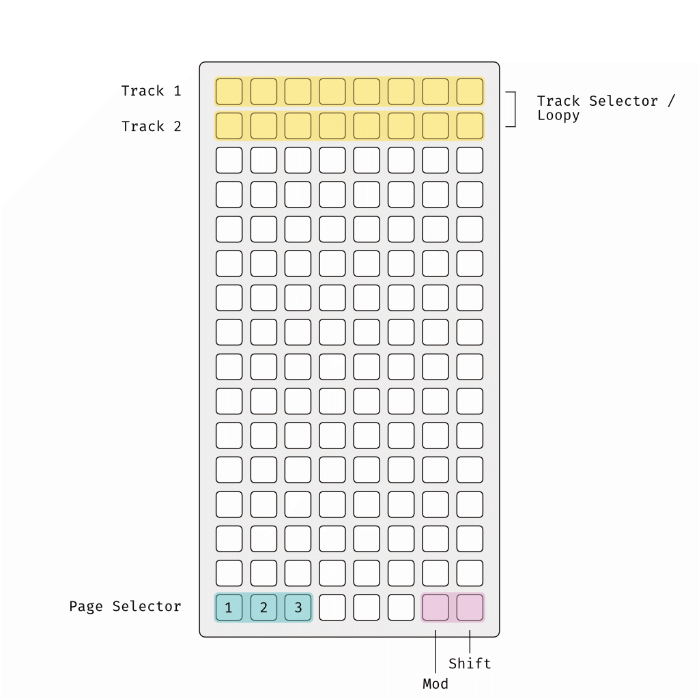
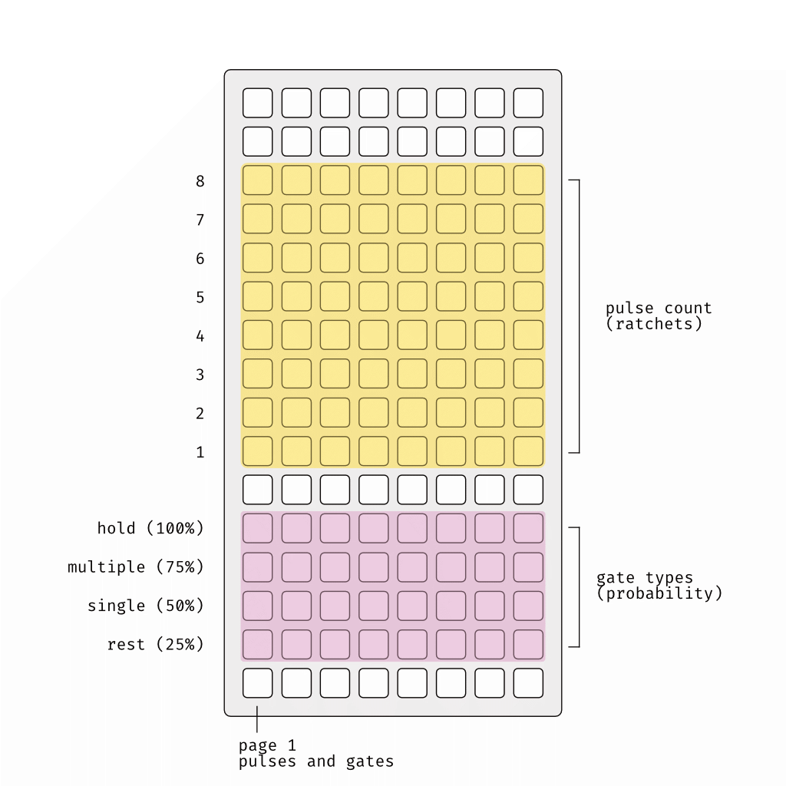
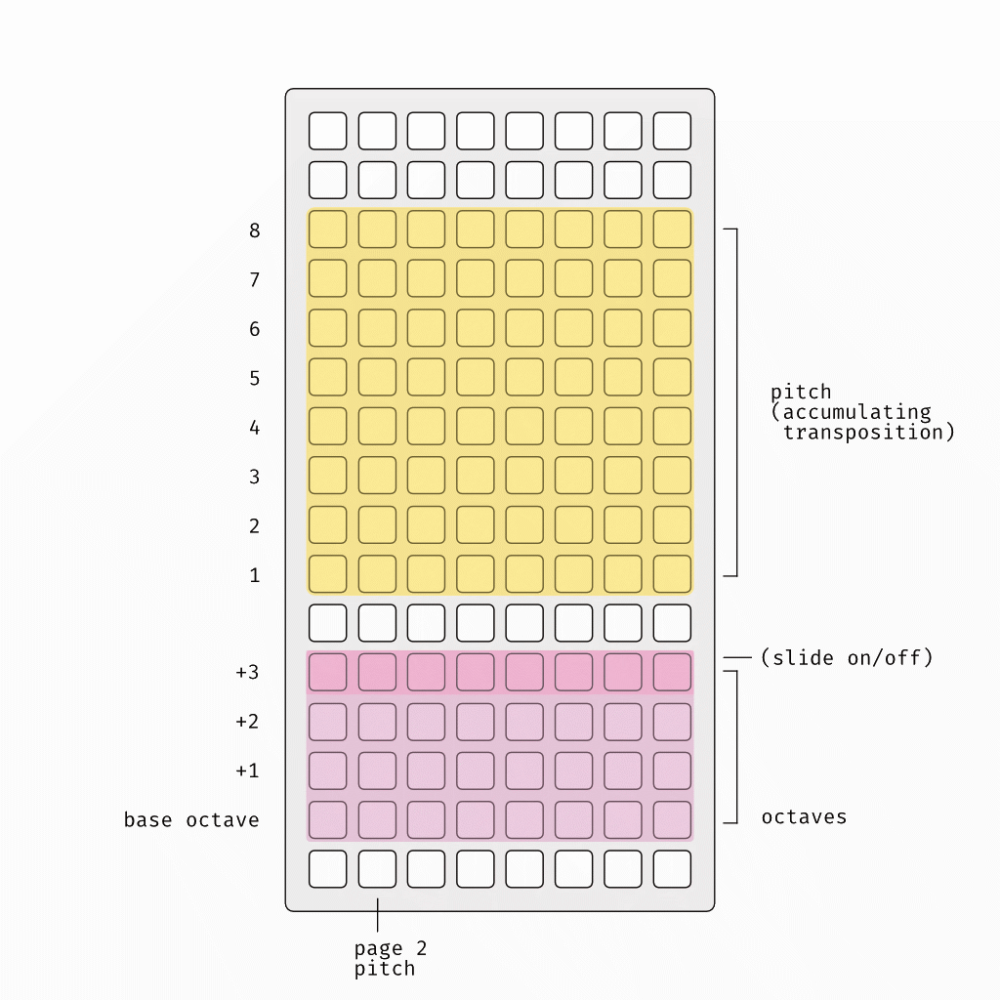
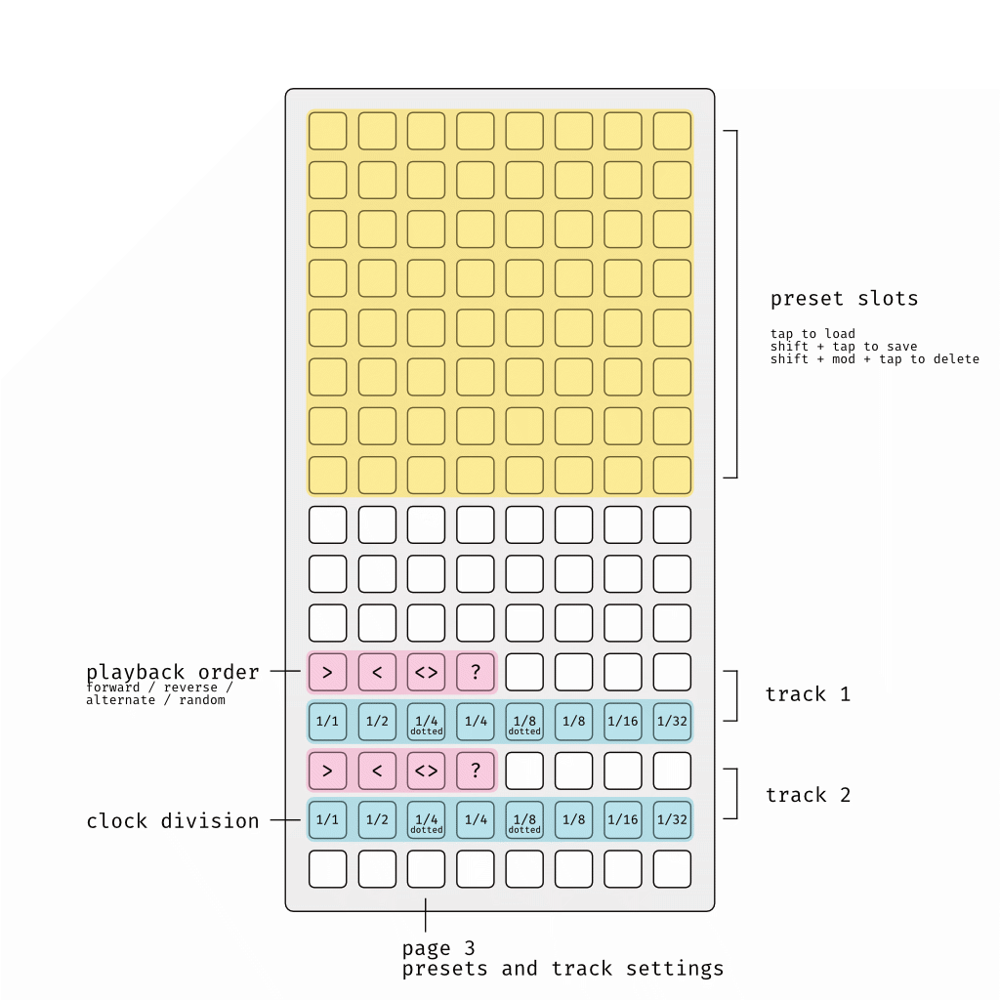

FYI:
This is a public beta and not a fully functional release version.
Please consider this when filing issues.

# metrix

[intellijel Metropolix](https://intellijel.com/shop/eurorack/metropolix/) for norns. 🤖💞

All functionality and terms are directly adopted from metropolix. 
If you're not familiar with it, please have a look at the metropolix manual or do some binge watching on [yt](https://youtu.be/niP5hVB43_8). 
And, if you're looking for a nice and powerful eurorack sequencer, consider buying it of course. :)

**TOC**
1. [Features](#features)
2. [Requirements](#requirements)
3. [Norns Keys/Encoders](#norns-keys-and-encoders)
4. [Grid Layout](#grid-layout)
    - [Pages](#pages)
    - [Modifier Keys](#modifier-keys)
5. [Page 1: Pulses and gates](#page-1-pulses-and-gates)
6. [Page 2: Pitch](#page-2-pitch)
7. [Page 3: Presets and track settings](#page-3-presets-and-track-settings)
8. [Params](#params)

## Features
- Two independent tracks with 8 stages each
- Control many functions directly via grid (pulse count, gate type, ratchets, pitch, octave, accumulation, slide and accent)
- Set playback direction (forward, reverse, alternate, random) and clock division (1/1 - 1/32) per track
- Loop the whole sequence or choose parts of it
- Quantize to a scale and root note via global params
- Connect to Crow or via MIDI
- Save and load up to 64 presets
- Generate random sequences 

## Requirements
- norns (210114)
- grid
- optional: crow

## Norns Keys and Encoders
**WIP;**
- `K2` Play / Pause
- `K3` Reset and restart

## Grid Layout
The grid layout of **metrix** is strongly influenced by [skylines](https://llllllll.co/t/skylines/38856) and Kria. 🙏

### Track Selector / Loopy
On pages 1 & 2, use the first two rows to select one of two tracks and to set the loop start and end points:
- Tap on the currently unselected track to **select** it.
- Tap and hold the start point and select the end point to set the **repeating stages**. This works in any direction.
- Tap on a stage on the currently selected track to select only a **single stage**.

### Page Selector
In the bottom left corner, you can choose among the following pages:

1. pulses and gates
2. pitch
3. presets and track settings

### Modifier Keys
In the bottom right corner, the `[shift]` and `[mod]` keys are located.
Hold these keys for secondary functions and shortcuts.

#### _shift_
Hold the `[shift]` key to switch to the secondary functions of a page. 
More on that on the corresponding sections.

#### _mod_
Hold the `[mod]` key to access some shortcuts:

- `[mod] + [page 1] / [page 2]`
**Randomize** the values related to that page
- `[mod] + [value]`
Set **all stages** to the selected value. Use the shift key additionally to access the secondary functions.
- `[mod] + [track selector]`
Set loopy to **repeat all stages** of the track

## Page 1: Pulses and gates
- Use the top matrix to choose the **pulse count** for each stage. 
- Use the bottom matrix to choose the **gate type** for each stage.
- Press and hold `[shift]` to access the matrices for **ratchets** (top) and **probability** (bottom).

## Page 2: Pitch
- Use the top matrix to choose the **pitch** for each stage. 
- Use the bottom matrix to choose the **octave** for each stage.
- Press and hold `[shift]` to access the matrices for **accumulating transposition** (top), **slide** on/off and **accent** on/off (bottom).

## Page 3: Presets and track settings
- **Save** a preset by holding `[shift]` and selecting on of the 64 preset slots on the top.
- **Load** a preset by tapping one of the preset slots.
- **Delete** a preset by holding `[shift]` and `[mod]` and selecting a preset slot.
- Choose the **playback order** and **clock division** for the corresponding track

## Crow
Connect crow to control your eurorack system:
- Outputs 1 and 3 send **gates, triggers or envelopes** (adjustable in the params) for each pulse
- Outputs 2 and 4 send **1v/octave** pitch voltage

## Params

### General
Param | Description
----- | ---
Scale | Choose on of the provided scales
RootNote | Choose the root note of that scale
MIDI Device | Choose a MIDI device to send the sequence data to

### Track 1/2
Param | Description
----- | ---
Output: Mute | Mute the selected track
Output: Audio | Play audio on/off
Output: MIDI | Send MIDI on/off
Output: Crow | Send to Crow on/off
Pitch: Octave Range | Adjust the via grid controlable octave range 
Pitch: Acc. Limit | Set the limit over which transpositions are allowed to accumulate
Pitch: Transpose Trigger | Apply the accumulation per stage / pulse / ratchet
Pitch: Slide Time | Sets the amount of time it takes to move from one pitch to the next (Note: Only 'analog' slide type is supported atm.)
MIDI: Channel | Sets the MIDI channel for sending the track sequence to
Crow: Gate Type | Sets the signal type that crow generates: gate / trigger / envelope
Crow: Env. Attack | Sets the attack time of the generated envelope
Crow: Env. Sustain | Sets the sustain time of the generated envelope
Crow: Env. Release | Sets the release time of the generated envelope
